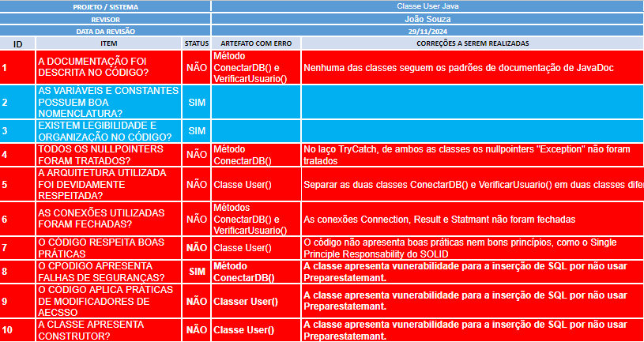
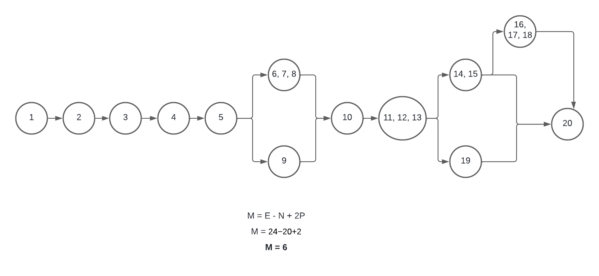

# AF_UX-UI

O código em geral apreenta a classe User com dois métodos, verificarUsuario e conectarDB. Todavia, há algumas melhorias que possam ser aplicadas para melhor funcionamento do código, alem disso, seguir as boas práticas e princípios SOLID.
Com isso, g/tem-se a seguinte planilha:

## Diagrama Complexidades

